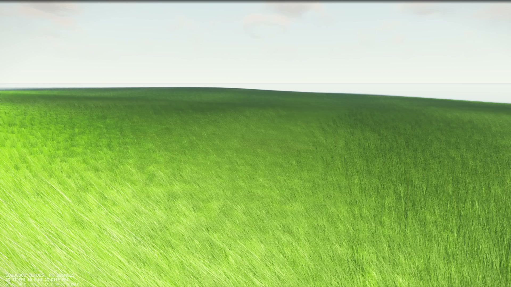
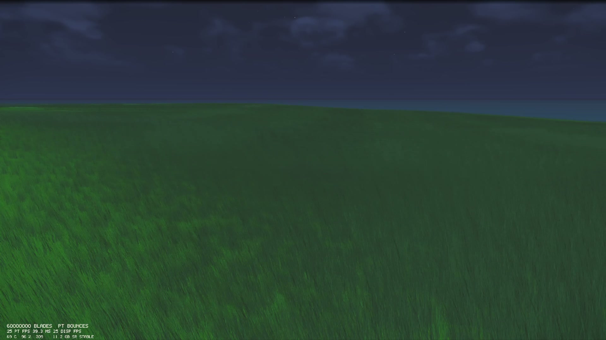

# GrassStress

A native Windows DirectX 12 / DXR meadow that **builds 60,000,000** wind-animated grass blades into a real acceleration structure and **draws** the visible ones as raster ribbons. Built as an RTX 5080 stress test: every blade exists as a procedural AABB in the grass BLAS, the sward is instanced on top of a path-traced ground and sky, and leftover silicon is used when it actually has work (SMs for A-trous, tensor cores for DLSS, copy engine and NVENC on `--offline`).



*Live capture on an RTX 5080: 60,000,000 blades in the field, DLSS Super Resolution, ~25 FPS at 1080p.*



*Same field at night. Keys `1`–`4` jump sunrise / noon / golden hour / night; arrows nudge the clock.*

## What you are looking at

The meadow is not a tiled texture or a few thousand cards. It is a spatial field of individual blades:

| Piece | Count |
|---|---|
| Meadow patches | 750 × 500 = **375,000** |
| Blades per patch | **160** (a mix of short turf and taller stems) |
| Blade AABBs in the grass BLAS | **60,000,000** |
| What a blade is | A wind-bent ribbon. The DXR intersection shader tests a two-plane reconstruction; the overlay draws a camera-facing card of the same seed |

The ground is a heightfield. Wind, sun, and moon come from a CPU environment simulation that the shaders read every frame. Walking through the field (`F2`) pushes a local grass wake — blades lean away from your feet without a CPU geometry rewrite.

The HUD reports blade count, path-traced FPS, frame time, display FPS (after DLSS / frame gen), GPU temperature, utilization, watts, VRAM, DLSS mode (`SR` / `RR`), and whether the machine is `STABLE` or `CHOKING`. The 1% low is computed only to decide `CHOKING`; it is not printed.

## How it works

GrassStress is a **hybrid raster + ray-tracing** path, not a pure offline tracer.

```text
CPU field (60M blade AABBs + 375k patches)
        │
        ▼
  DXR grass BLAS (chunked, instance mask 0x2)
  DXR terrain BLAS (instance mask 0x1)
        │
        ▼
  raytracing.hlsl
  (ground + sky on mask 0x1;
   grass is not in the primary / sun path)
        │
        ▼
  grass_overlay.hlsl
  (instanced ribbons so the meadow
   actually draws; sun visibility is
   the path-tracer alpha, not a
   per-fragment walk of the grass AS)
        │
        ▼
  sm_denoise.hlsl     (A-trous on SMs)
        │
        ▼
  Streamline DLSS     (SR in realtime; RR optional)
        │
        ▼
  present_tonemap     → swap chain
        │
        └── --offline → OptiX HDR denoise → PNG → NVENC
```

1. **Field build.** `grass::build()` stamps a 750×500 patch grid and expands every patch into per-blade AABBs. Those AABBs are the DXR procedural primitives — the intersection shader reconstructs the curved ribbon from the patch seed, so the geometry itself is not stored as triangles. The 60M AABBs are packed into spatial BLAS chunks (30 × 20 cells).
2. **Primary lighting.** `raytracing.hlsl` path-traces the ground and sky on instance mask `0x1` (terrain). Primary rays and sun shadows do **not** hit the grass BLAS. Terrain also skips the extra bounce into mask `0x3`; local ground occlusion comes from the terrain shading, not blade contact shadows.
3. **Visible meadow.** `grass_overlay.hlsl` rasterizes frustum-visible patches as instanced ribbons. Each fragment reuses the path-tracer’s sun visibility from the color-buffer alpha. `RayQuery` helpers that would walk the 60M-blade AS for a sun ray and a bounce are still in that file; the pixel shader does not call them. The overlay writes depth, motion vectors, and G-buffer so DLSS has something honest to reconstruct.
4. **Denoise / upscale.** An A-trous compute pass (`sm_denoise.hlsl`) runs on the SMs. NVIDIA Streamline then runs DLSS Super Resolution (and optionally Ray Reconstruction / Multi Frame Generation) on the tensor cores.
5. **Present.** `present_tonemap.hlsl` tone-maps and grades the HDR buffer to the swap chain. VSync is off by default so the HUD shows real frame time.

`--offline` freezes the cinematic, accumulates samples per camera, runs OptiX HDR denoise on the tensor cores, dumps PNGs on a dedicated D3D12 COPY queue, and encodes with `ffmpeg -c:v h264_nvenc`.

### What uses which unit

| Unit | What uses it |
|---|---|
| RT cores | DXR ground / sky path trace (mask `0x1`). The grass BLAS is built and resident; the live meadow does not walk it per fragment |
| CUDA / SM cores | A-trous denoise |
| Tensor cores | DLSS SR (live); OptiX HDR denoise on `--offline` dumps |
| Copy engine | Dedicated D3D12 COPY queue for `--offline` PNG readback |
| NVENC | `ffmpeg -c:v h264_nvenc` after an offline sequence |

Press **E** to cycle the HUD experiment id. **R2 QMC** (and **STACK**) replace the hashed bounce sample with an R2 sequence. Fiber BSDF is the default blade shading, not a toggle. HASHGI / ReSTIR / path-space filtering / radiance cascades are named on the HUD and written up in [`docs/OBSCURE_PAPERS.md`](docs/OBSCURE_PAPERS.md), but they no longer run in `sm_denoise.hlsl`. Blackwell / DLSS 4 notes live in [`docs/RTX5080_PAPERS.md`](docs/RTX5080_PAPERS.md) and [`docs/DLSS4_AND_RTX_KIT.md`](docs/DLSS4_AND_RTX_KIT.md).

## Build

Windows only. Same toolchain as [DenseTrees](https://github.com/SamG-Coder/DenseTrees):

- MSYS2 UCRT64 GCC, CMake, Ninja (`C:\msys64\ucrt64\bin`)
- [DirectX Shader Compiler](https://github.com/microsoft/DirectXShaderCompiler) (`winget install Microsoft.DirectX.ShaderCompiler`)
- An NVIDIA GPU with DXR 1.1 (RTX 20-series or newer). The 60M-blade field is sized for a 16 GB RTX 5080.

```text
build.cmd
run.cmd
```

`build.cmd` compiles the HLSL with DXC, configures CMake/Ninja, links `GrassStress.exe`, and runs `grass_field_tests` (the field must emit exactly 60,000,000 blades).

Optional Streamline / DLSS needs the NVIDIA Streamline SDK unpacked under `third_party/streamline` and, for the native G-buffer hook, MSVC to build `sl_bridge.dll`. Without that, the native path still runs — you just lose DLSS.

## Run

```text
run.cmd
```

The window opens at 1920×1080 with an auto-playing cinematic. OBS Game Capture the window. VSync is off so the HUD is honest.

| Command | What it does |
|---|---|
| `run.cmd` | Live cinematic |
| `run.cmd --bench 120` | Run 120 frames, write `video/bench.txt`, quit |
| `run.cmd --offline` | Frozen cameras, 16 spp, 48 shots, NVENC encode |
| `run.cmd --offline 12 36` | 12 spp, 36 shots |

Offline frames land in `video/offline/`. The encode is `video/RTX5080-10M-Grass-OFFLINE.mp4`.

## Controls

| Key | Action |
|---|---|
| `C` | Toggle cinematic / free orbit |
| `F2` | First-person walk through the field |
| WASD + mouse | Walk (first person). Shift sprint, Space jump |
| Left-drag / wheel | Orbit and zoom (orbit mode) |
| `E` | Cycle paper experiment id (HUD fourth line) |
| `D` | Cycle DLSS quality (Off → Quality → Balanced → Performance → Ultra → DLAA). In first person, `D` is strafe right |
| `F` | Cycle frame generation (Off → 2× → 4× → 6× → Dynamic) |
| `H` / `F1` | HUD on/off |
| `V` | VSync on/off |
| `F11` | Borderless fullscreen |
| `R` | Restart cinematic + title card |
| `1`–`4` | Sunrise / noon / golden hour / night |
| Left / Right | Nudge time of day |
| `W` | Toggle wind (orbit / cinematic). In first person, `W` is walk forward |
| Escape | Release mouse, or quit |

## Layout

| Path | Role |
|---|---|
| `src/grass_field.cpp` | Deterministic 60M-blade meadow |
| `src/environment_simulation.cpp` | Sun, moon, wind, fog, time of day |
| `src/first_person_camera.cpp` | Walk camera + foot position for the wake |
| `src/dxr_renderer.cpp` | DX12 device, BLAS/TLAS, frame graph |
| `src/streamline_host.cpp` | DLSS / Reflex / frame-gen via Streamline |
| `src/optix_denoise.cpp` | Offline OptiX HDR denoise |
| `src/gpu_telemetry.cpp` | Temperature, power, VRAM, clocks for the HUD |
| `shaders/raytracing.hlsl` | Ground / sky path tracer + unused-in-live grass intersection |
| `shaders/grass_overlay.hlsl` | Raster ribbons |
| `shaders/sm_denoise.hlsl` | A-trous SM denoise |
| `shaders/hud_overlay.hlsl` | Blade count / FPS / telemetry HUD |
| `shaders/present_tonemap.hlsl` | Display map |
| `obs/` | OBS scene + YouTube letterbox overlays |

## License

Application source is published as-is for the stress-test writeup. NVIDIA Streamline, NGX, and OptiX remain under their own NVIDIA licenses in `third_party/` and are not redistributed as part of this description.
